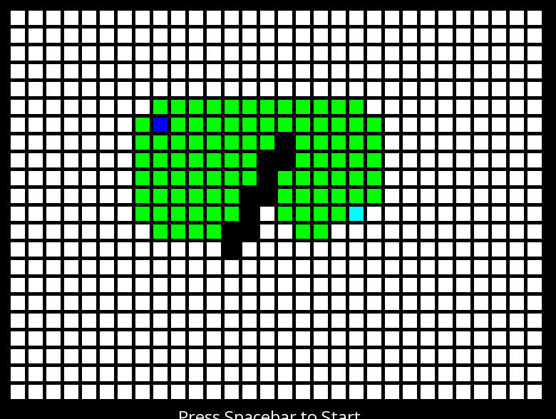

# AStarProject

This is an interactive, graphical demonstration of the A* (A-star) pathfinding algorithm built in C++ using the SFML library. It allows a user to visualize the algorithm's search pattern in real-time.

## Project Report

This project was built to visualize the A* pathfinding algorithm. It uses the SFML library for all rendering, windowing, and user input. The application creates a 30x22 grid of nodes. The user can interact with the grid in the following ways:

1.  **Left-click** on an empty cell to place the **Source** (blue).
2.  **Left-click** again to place the **Target** (cyan).
3.  **Left-click** (and drag) on any other cells to create **Walls** (black).
4.  **Press Spacebar** to begin the simulation.

Once started, the algorithm runs one step per frame, allowing you to see the "open set" (active search nodes) expand in green. The application also displays the G-Cost (cost from start) and H-Cost (heuristic cost to target) of whichever cell the mouse is currently hovering over.

## How It Works

The project is broken into two main parts: the SFML/input handling (`main.cpp`) and the A* algorithm itself (`astar.cpp`).

### 1. Main Application (`main.cpp`)

The `main.cpp` file is responsible for all the user-facing logic:
* Setting up the 800x600 SFML window and limiting the framerate.
* Initializing the `grid[30][22]` array of `grid_cell` objects and their `sf::RectangleShape` components.
* Handling all user input (mouse clicks for placing nodes/walls, keyboard for starting the simulation).
* Drawing the grid, text, and other UI elements to the window in the main render loop.
* Calling the `run(grid)` function from `astar.cpp` once per frame after the simulation has `started`.

### 2. The A* Algorithm (`astar.cpp`)

This is the core logic. The algorithm uses two `std::vector` lists to manage the search: `open_set` and `closed_set`.

The `grid_cell` struct (defined in `astar.h`) is the key data structure. It holds its G and H costs, its coordinates, its `cell_type`, and a `void* previous` pointer, which is used to trace the path back to the start.

The main algorithm loop (`run` function) performs the following steps every frame:
1.  **Find Cheapest Node:** It calls `find_cheapest` to iterate through the *entire* `open_set` and find the node with the lowest F-Cost (where `F = G + H`).
2.  **Update Sets:** It moves this cheapest node from the `open_set` to the `closed_set`.
3.  **Check for Target:** It checks if the `finished` flag has been set. This flag is set inside `activate_paths` if one of the neighbors being activated is the target.
4.  **Activate Neighbors:** It calls `activate_paths` on the cheapest node. This function checks all four adjacent neighbors (no diagonal movement is implemented). For each valid neighbor:
    * It calculates its G-Cost and H-Cost.
    * It sets the neighbor's `previous` pointer to the current node.
    * It colors the neighbor green (`path_active`) and adds it to the `open_set`.

The H-Cost (heuristic) is calculated using the **Manhattan Distance** (`abs(dx) + abs(dy)`), which is the appropriate heuristic for a grid that only allows 4-directional movement.

## Challenges and Reflections

This project works as a visualization, but the A* implementation itself is pretty inefficient.

The biggest performance bottleneck is using `std::vector` for the `open_set`. The `find_cheapest` function has to loop through the entire vector *every single frame* just to find the next node. This is a classic O(n) operation. A much, much better approach would have been to use a **Min-Heap (Priority Queue)**, which would make finding the cheapest node an O(1) operation and insertion O(log n). As the open set grows, the current implementation will slow down significantly.

I also never implemented the final path reconstruction. The algorithm correctly *finds* the target and stops, but it doesn't then trace back all the `previous` pointers to draw the final, shortest path in a different color. That would be the next logical feature to add.

It would also have been a prudent course of action to add some other heuristics, instead of just using basic `Manhattan Distance.`  Implementing `Octile or Chebyshev` would have been much more efficient... but Manhattan is easy.

Finally, the error handling is basically non-existent. It just calls `perror` and `exit(-1)`, which is a terrible way to handle a path not being found (e.g., if the user completely walls off the target).

## How to Build

The project uses CMake.
1.  You must have **SFML** installed on your system (libraries: `sfml-graphics`, `sfml-audio`, `sfml-window`, `sfml-system`).
2.  Clone the repository.
3.  Create a build directory: `mkdir build && cd build`
4.  Run CMake: `cmake ..`
5.  Build the project: `make` (or use your preferred build tool/IDE).
6.  The executable will be named `AStarProject`.
